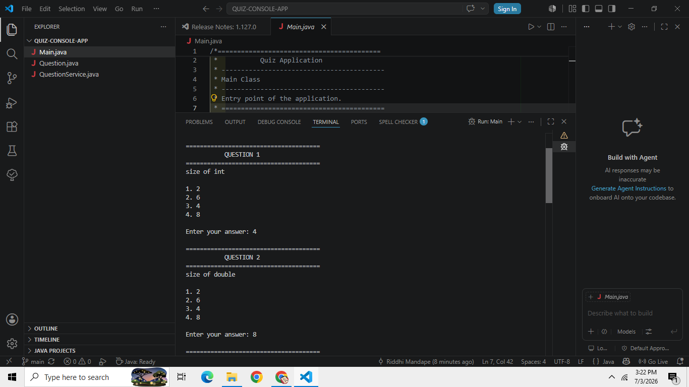
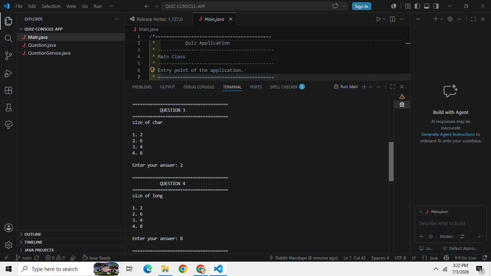
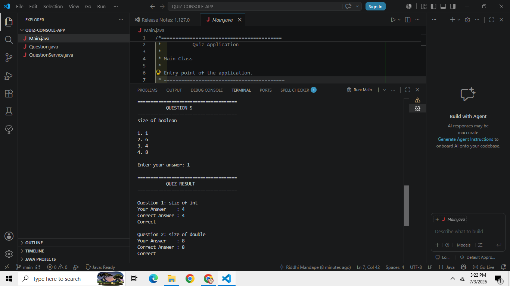
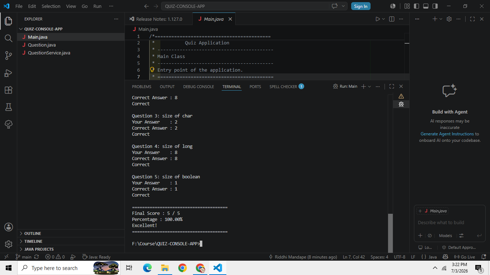

# 🧠 Quiz Console App (Java)

## 📌 About the Project
A Java-based console quiz application built using Object-Oriented Programming principles.  
It allows users to answer multiple-choice questions and calculates the final score.

---

## 🚀 Features
- Multiple-choice questions
- Score calculation
- Clean OOP structure
- Console-based interaction

---

## 🛠️ Tech Stack
- Java
- OOP Concepts
- Arrays & Classes
- Console I/O

---

## 📸 Output Screenshots

### Quiz Interface

### Final Result

